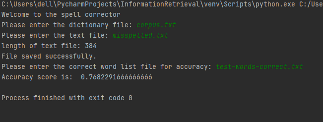

# SpellingCorrector with Peter Norvig Approach

Algorithms are based on Edit distance (Damerau-Levenshtein distance).

To run the program, firstly enter the file name to be used as a dictionary with the .txt extension. 
Then enter the file name with the words to be corrected with the extension .txt. 
Finally, enter the file name to be compared with the .txt extension to get the accuracy score.

The program receives input and outputs as follows;

The program saves the corrected words with the name correct.txt and compares them with the correct word list 
given as input and gives accuracy score.
